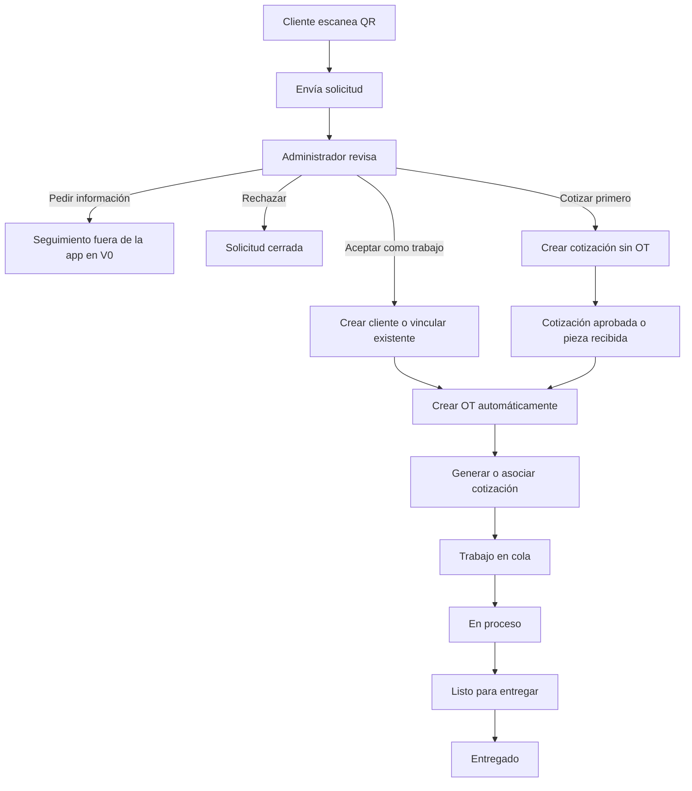
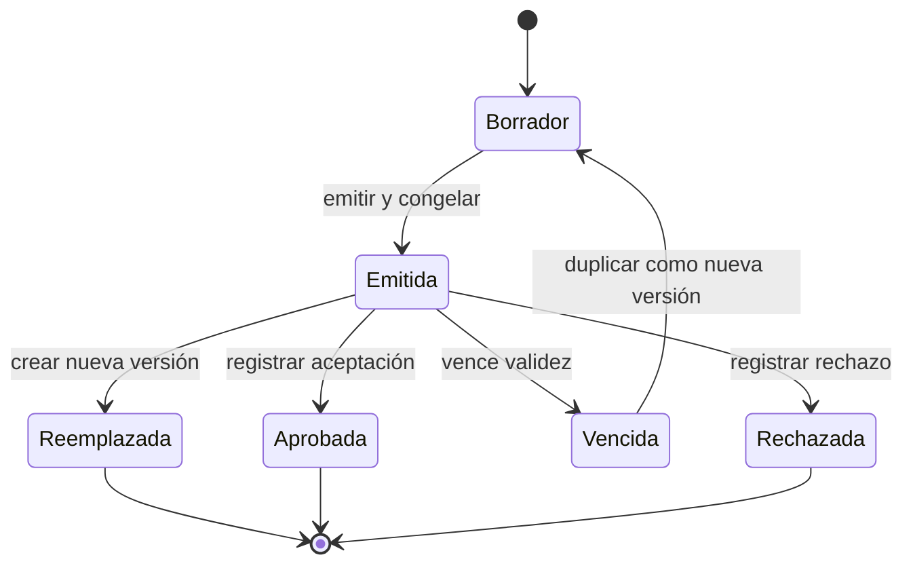
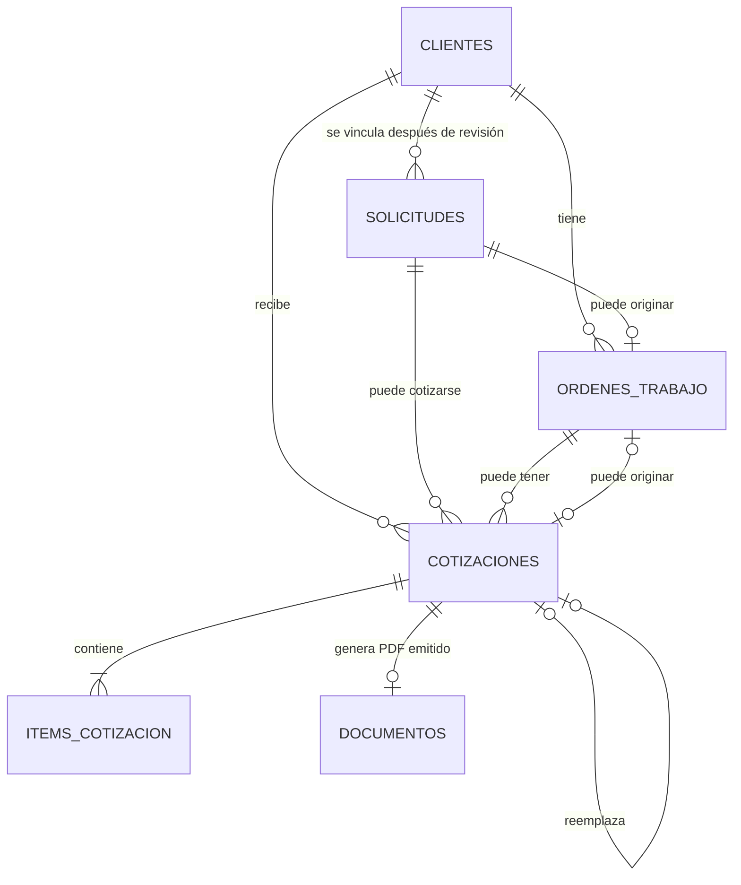
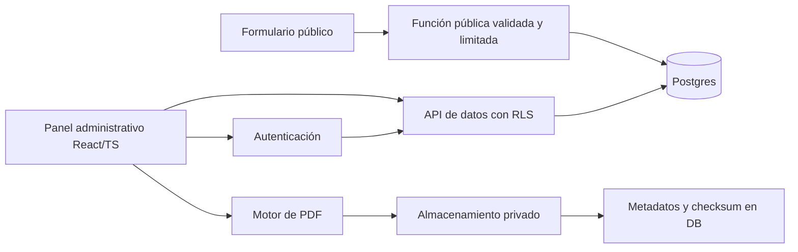

# PRD — Sistema de gestión para taller

**Nombre provisional del producto:** TallerFlow  
**Tipo de documento:** Product Requirements Document (PRD) / Especificación funcional  
**Versión del documento:** 1.0  
**Estado:** Borrador para validación del propietario del taller  
**Fecha:** 4 de agosto de 2026  
**Responsables de validación:** propietario del taller y responsable del proyecto  
**Idioma y mercado inicial:** español, Chile  

---

## Índice

1. [Resumen ejecutivo](#1-resumen-ejecutivo)
2. [Contexto y problema](#2-contexto-y-problema)
3. [Visión del producto](#3-visión-del-producto)
4. [Objetivos, resultados y métricas](#4-objetivos-resultados-y-métricas)
5. [Alcance del producto](#5-alcance-del-producto)
6. [Usuarios, roles y permisos](#6-usuarios-roles-y-permisos)
7. [Glosario](#7-glosario)
8. [Reglas de negocio](#8-reglas-de-negocio)
9. [Flujos de trabajo](#9-flujos-de-trabajo)
10. [Hoja de ruta por versiones](#10-hoja-de-ruta-por-versiones)
11. [Arquitectura de información y pantallas](#11-arquitectura-de-información-y-pantallas)
12. [Requisitos funcionales detallados](#12-requisitos-funcionales-detallados)
13. [Modelo de datos](#13-modelo-de-datos)
14. [Requisitos de documentos PDF](#14-requisitos-de-documentos-pdf)
15. [Arquitectura técnica](#15-arquitectura-técnica)
16. [Seguridad y privacidad](#16-seguridad-y-privacidad)
17. [Requisitos no funcionales](#17-requisitos-no-funcionales)
18. [Copias, exportaciones y recuperación](#18-copias-exportaciones-y-recuperación)
19. [Criterios de aceptación de la V0](#19-criterios-de-aceptación-de-la-v0)
20. [Plan de pruebas](#20-plan-de-pruebas)
21. [Plan incremental de implementación de la V0](#21-plan-incremental-de-implementación-de-la-v0)
22. [Estrategia de despliegue](#22-estrategia-de-despliegue)
23. [Riesgos y mitigaciones](#23-riesgos-y-mitigaciones)
24. [Estrategia de implementación asistida por IA](#24-estrategia-de-implementación-asistida-por-ia)
25. [Mejoras futuras y backlog](#25-mejoras-futuras-y-backlog)
26. [Decisiones pendientes antes de programar](#26-decisiones-pendientes-antes-de-programar)
27. [Definición de éxito al terminar V0](#27-definición-de-éxito-al-terminar-v0)
28. [Referencias técnicas y normativas](#28-referencias-técnicas-y-normativas)
29. [Aprobación del documento](#29-aprobación-del-documento)

---

## 1. Resumen ejecutivo

TallerFlow será una aplicación web orientada primero al teléfono que reunirá en un solo lugar las solicitudes de clientes, órdenes de trabajo, prioridades, cotizaciones, pagos y documentos de un taller. Su propósito es evitar trabajos olvidados, piezas sin identificar, fechas incumplidas y datos escritos varias veces.

La aplicación se construirá de forma incremental. La visión final se conserva, pero cada versión deberá entregar una parte pequeña, utilizable, probada y comprensible antes de ampliar el alcance.

La **V0 obligatoria** validará el circuito central:

> QR → solicitud → revisión → orden de trabajo o cotización previa → cotización PDF → ejecución y seguimiento del trabajo.

La V0 incluirá desde el comienzo:

- Formulario público accesible mediante QR, sin cuenta de cliente.
- Revisión administrativa de solicitudes.
- Conversión automática de una solicitud aceptada en orden de trabajo (OT).
- Posibilidad de cotizar una solicitud antes de crear una OT.
- Registro manual de trabajos y cotizaciones.
- Panel móvil, cola de trabajo, prioridades, fechas, estados y búsqueda.
- Un único editor de cotización reutilizable, con datos precargados cuando corresponda.
- Cotización profesional en PDF, con logo y datos del taller.
- Guardado y versionado básico de cotizaciones emitidas.
- Exportaciones CSV para uso operativo.
- Controles mínimos de autenticación, privacidad, integridad y respaldo.

La V0 no pretende ser un ERP, un sistema contable ni una integración tributaria con el SII. Una cotización generada por el sistema es un documento comercial y **no reemplaza una boleta o factura electrónica**.

---

## 2. Contexto y problema

### 2.1 Situación actual

El taller recibe encargos por distintos medios: presencialmente, teléfono, WhatsApp y consultas de clientes. La información puede quedar repartida, incompleta o depender de la memoria del propietario. Los principales riesgos son:

- Que un trabajo aceptado no quede registrado.
- No saber cuál trabajo debe realizarse a continuación.
- No reconocer de quién es una pieza.
- Confundir la fecha solicitada por el cliente con una fecha realmente comprometida.
- Reescribir nombres, teléfonos, piezas y trabajos en varios documentos.
- Perder el precio ofrecido o reemplazar por error una cotización ya enviada.
- No tener una visión rápida de trabajos atrasados, en proceso o listos.
- Depender de conversaciones de WhatsApp como registro operativo.

### 2.2 Oportunidad

Una aplicación pequeña y adaptada al flujo real del taller puede convertir cada entrada —QR o registro manual— en información estructurada, reutilizable y trazable. La primera hipótesis que se debe validar no es tecnológica, sino operacional:

> Los clientes enviarán solicitudes mediante el QR y el propietario utilizará el panel para revisarlas, cotizar, registrar y priorizar trabajos.

---

## 3. Visión del producto

Crear una herramienta sencilla y confiable que acompañe todo el ciclo de un trabajo de taller, desde la primera consulta del cliente hasta la entrega, sin obligar al propietario a escribir los mismos datos dos veces ni a comprender procesos técnicos complejos.

### 3.1 Propuesta de valor

- **Para el propietario:** una vista única de qué llegó, qué debe hacer, qué está atrasado, qué cotizó y qué debe entregar.
- **Para el cliente:** una forma fácil de enviar una solicitud desde su teléfono y recibir un folio de referencia.
- **Para el responsable del proyecto:** una base mantenible que pueda crecer por versiones sin reconstruir el sistema completo.

### 3.2 Principios de producto

1. **Ingresar una vez, reutilizar siempre.** Los datos capturados en una solicitud, cliente, OT o cotización se reutilizan sin volver a escribirlos.
2. **Primero el teléfono.** Las acciones frecuentes deben poder realizarse cómodamente con una mano y poca escritura.
3. **El sistema apoya; el propietario decide.** La aplicación recomienda prioridades y calcula montos, pero no compromete automáticamente precio, plazo o aceptación.
4. **Una sola lógica por función.** Existe un único editor de cotizaciones, aunque se abra desde una OT, una solicitud, un cliente o desde cero.
5. **Documentos emitidos no se alteran silenciosamente.** Toda modificación posterior crea una versión nueva.
6. **Seguridad por defecto.** El público solo puede enviar una solicitud; no puede leer datos del taller ni solicitudes ajenas.
7. **Crecimiento incremental.** No se implementa una función futura hasta que la versión actual esté probada.
8. **Mantenible por una persona.** Se priorizan tecnologías conocidas, documentación clara, pocas dependencias y decisiones reversibles.

---

## 4. Objetivos, resultados y métricas

### 4.1 Objetivos de la V0

- Registrar el 100 % de los trabajos aceptados en una OT.
- Permitir que una solicitud por QR se convierta en OT o cotización sin reescribir datos.
- Generar y volver a descargar una cotización PDF profesional.
- Mostrar en menos de un minuto qué trabajo sigue, qué está atrasado y de quién es una pieza.
- Permitir registrar manualmente los casos que no provengan del QR.
- Mantener privados los datos administrativos y personales.
- Probar el sistema durante dos semanas antes de declararlo apto para uso normal.

### 4.2 Indicadores de éxito del piloto

| Indicador | Meta inicial |
|---|---:|
| Trabajos aceptados con OT asociada | 100 % |
| Solicitudes aceptadas que requieren reingreso manual de datos | 0 % |
| Cotizaciones emitidas que pueden volver a descargarse | 100 % |
| Tiempo medio para encontrar una OT por nombre, teléfono, pieza o folio | < 30 segundos |
| Trabajos activos sin estado o fecha de recepción | 0 |
| Incidentes donde un visitante público lee datos ajenos | 0 |
| Días de uso efectivo durante piloto de 14 días | ≥ 10 |
| Errores bloqueantes abiertos al cierre del piloto | 0 |

Las metas deberán revisarse con el propietario después de la primera semana. No se usarán métricas para penalizarlo; servirán para saber si la herramienta realmente ayuda.

### 4.3 No objetivos de la V0

- Reemplazar la contabilidad del taller.
- Emitir boletas, facturas o DTE.
- Automatizar WhatsApp o correo de forma completa.
- Gestionar inventario, costos contables o remuneraciones.
- Permitir cuentas de clientes.
- Funcionar sin conexión para operaciones críticas.
- Soportar varias sucursales o múltiples roles avanzados.

---

## 5. Alcance del producto

### 5.1 Alcance funcional de la V0

#### Administración

- Un usuario administrador creado de forma controlada.
- Inicio y cierre de sesión.
- Recuperación de acceso por correo si el proveedor de autenticación se configura correctamente.
- Registro público de administradores deshabilitado.

#### Solicitudes mediante QR

- Página pública sin inicio de sesión.
- Código QR que apunta a una URL estable del formulario.
- Campos obligatorios: nombre, teléfono, pieza y trabajo solicitado.
- Campos opcionales: empresa/razón social, RUT, correo, fecha en que lo necesita y observaciones.
- Validación, protección básica contra automatización y consentimiento/aviso de privacidad.
- Folio único como `SOL-2026-0001`.
- Confirmación que no promete aceptación, precio ni fecha.

#### Gestión de solicitudes

- Lista, detalle y búsqueda.
- Estados: nueva, en revisión, requiere información, aceptada, cotizada primero y rechazada.
- Acciones: aceptar como trabajo, cotizar primero, pedir información, rechazar y editar/completar antes de convertir.
- Aceptar como trabajo crea una OT de manera atómica e idempotente.
- Cotizar primero crea una cotización asociada sin crear todavía la OT.

#### Órdenes de trabajo

- Creación automática desde solicitud aceptada.
- Creación desde cotización aprobada o cuando llegue la pieza.
- Creación manual para trabajos presenciales, telefónicos o provenientes de WhatsApp.
- Folio único como `OT-2026-0001`.
- Cliente, teléfono, pieza, trabajo, cantidad, fechas, prioridad, estado, cola, origen y observaciones internas.
- Lista, detalle, edición, búsqueda y cambio de estado.
- Botón `Generar cotización` dentro de cada OT.

#### Cotizaciones

- Botón general `Generar cotización` en el panel.
- Un único editor abierto desde OT, solicitud, cliente o desde cero.
- Precarga automática de todos los datos disponibles.
- Múltiples líneas de trabajo.
- Cálculo automático de subtotales, descuento, neto, IVA, total y anticipo requerido.
- Vista previa, emisión, guardado, descarga y nueva versión.
- Folio como `COT-2026-0001` y estados borrador, emitida, aprobada, rechazada, vencida y reemplazada.
- PDF profesional con logo, datos del taller, cliente, detalle, totales y condiciones.

#### Panel y búsqueda

- Solicitudes nuevas.
- Nuevo trabajo.
- Generar cotización.
- Trabajos pendientes, para hoy, atrasados y listos para entregar.
- Próximo trabajo recomendado.
- Orden manual de la cola.
- Búsqueda por folios, nombre, teléfono, pieza y trabajo.

#### Exportaciones y recuperación

- Exportar trabajos a CSV.
- Exportar cotizaciones a CSV.
- Procedimiento documentado para exportar/restaurar la base de datos mediante el proveedor.
- Prueba de restauración antes de usar datos reales.

### 5.2 Fuera de alcance de la V0

- Fotografías, audio y video.
- PDF de orden de trabajo para uso productivo (se especifica ahora, se implementa en V2).
- Registro de pagos recibidos y saldo operacional.
- Carga de órdenes de compra.
- Configuración editable del taller desde la interfaz.
- Envío automático de mensajes o documentos.
- Página pública para consultar estado.
- Historial completo de todos los cambios.
- Materiales, inventario y calculadoras de precios.
- PWA instalable y borradores offline.
- Múltiples usuarios, roles o permisos diferenciados.

### 5.3 Alcance futuro conservado

La visión final incluye clientes avanzados, cotizaciones versionadas, órdenes de compra, pagos, fotos y documentos privados, PDF de OT, historial, materiales, PWA, WhatsApp, notificaciones, inventario, calculadoras, múltiples trabajadores y reportes. Que una función esté fuera de la V0 no significa que se descarte.

---

## 6. Usuarios, roles y permisos

### 6.1 Visitante / cliente

**Objetivo:** enviar una solicitud desde el QR sin crear una cuenta.

**Puede:**

- Abrir el formulario público.
- Completar y enviar una solicitud.
- Ver el folio y mensaje de confirmación de su envío actual.

**No puede:**

- Enumerar, buscar ni leer solicitudes.
- Leer clientes, OT, cotizaciones o configuración interna.
- Elegir el folio, estado o fecha comprometida.
- aceptar precios o cambiar información después del envío en la V0.

### 6.2 Administrador único / propietario

**Objetivo:** administrar la operación completa.

**Puede:**

- Acceder a todos los módulos administrativos.
- Revisar y decidir solicitudes.
- Crear y editar clientes, OT y borradores de cotización.
- Emitir y versionar cotizaciones.
- Cambiar estados, prioridades y orden de la cola.
- Descargar PDFs y exportaciones.

### 6.3 Responsable técnico

No es necesariamente un usuario dentro de la V0. Administra despliegues, migraciones, configuración, copias y recuperación. Nunca debe compartir claves privadas ni usar datos reales en desarrollo.

### 6.4 Roles futuros

- Trabajador: ve y actualiza trabajos asignados.
- Administrativo: gestiona clientes, cotizaciones, OC y pagos.
- Supervisor: prioriza y revisa métricas.
- Cliente autenticado: consulta estados y documentos autorizados.

---

## 7. Glosario

| Término | Definición |
|---|---|
| Solicitud | Información enviada por un cliente. No implica aceptación, precio ni fecha comprometida. |
| Orden de trabajo (OT) | Registro operativo de un trabajo que el taller aceptó o ingresó manualmente. |
| Cotización | Propuesta comercial de precio, alcance y condiciones. No es un documento tributario. |
| Versión de cotización | Nueva emisión que conserva el documento anterior y lo reemplaza sin borrarlo. |
| Orden de compra (OC) | Documento o referencia enviado normalmente por una empresa cliente para formalizar su compra. El taller lo registra; no lo emite. |
| Cliente | Persona o empresa a la que se asocian solicitudes, OT y cotizaciones. |
| Pieza | Objeto, conjunto o componente sobre el que se consulta o trabaja. |
| Trabajo | Servicio solicitado o comprometido sobre una pieza. |
| Folio | Identificador legible, único e inmutable de un registro. |
| Fecha solicitada | Fecha indicada por el cliente; es una preferencia, no un compromiso. |
| Fecha comprometida | Fecha confirmada por el taller. |
| Anticipo requerido | Monto solicitado en la cotización; no significa que haya sido pagado. |
| Abono recibido | Pago efectivamente registrado. Se implementa en V1. |
| Saldo | Total menos pagos efectivamente recibidos. Se implementa en V1. |
| Borrador | Documento editable que todavía no fue emitido al cliente. |
| Emitida | Cotización congelada con número, fecha, contenido y PDF propios. |
| RLS | Reglas de base de datos que limitan qué filas puede leer o modificar cada identidad. |
| DTE | Documento Tributario Electrónico regulado por el SII. |
| PWA | Aplicación web que puede ofrecer instalación y ciertas capacidades similares a una app. |

---

## 8. Reglas de negocio

Las reglas se identifican para poder relacionarlas con desarrollo y pruebas.

### 8.1 Entrada y reutilización de datos

- **RN-001 — Ingreso único:** el sistema no solicitará volver a escribir información ya disponible. Puede copiarla de forma controlada a una instantánea documental para preservar lo emitido.
- **RN-002 — Origen rastreable:** toda OT indicará si nació de una solicitud QR, una cotización o un registro manual.
- **RN-003 — Datos públicos no confiables:** el administrador podrá corregir o completar los datos enviados antes de crear un cliente, una OT o una cotización.
- **RN-004 — Resolución de cliente:** al convertir una solicitud, el administrador elegirá un cliente existente sugerido por coincidencia o creará uno nuevo. No se fusionarán personas automáticamente solo por coincidir el teléfono o RUT.
- **RN-005 — Instantáneas:** las cotizaciones emitidas conservarán una instantánea de los datos del cliente y del taller utilizados ese día, aunque esos registros cambien después.

### 8.2 Solicitudes

- **RN-010 — Sin compromiso automático:** enviar una solicitud no confirma aceptación, precio, fecha ni recepción física de la pieza.
- **RN-011 — Fecha solicitada:** la fecha ingresada por el cliente nunca se copiará como fecha comprometida sin confirmación explícita del administrador.
- **RN-012 — Decisiones posibles:** una solicitud puede rechazarse, requerir información, aceptarse como trabajo o cotizarse primero.
- **RN-013 — Aceptación crea OT:** aceptar como trabajo debe crear exactamente una OT en la misma operación. Si la acción se repite por error, no se crea otra.
- **RN-014 — Cotizar primero:** esta acción crea o abre una cotización y no crea una OT hasta que el administrador lo decida.
- **RN-015 — Rechazo preservado:** una solicitud rechazada no se elimina inmediatamente; queda disponible para control y posible retención/eliminación futura según la política de datos.

### 8.3 Órdenes de trabajo

- **RN-020 — OT significa trabajo aceptado:** una consulta o cotización independiente no obliga a crear OT.
- **RN-021 — Recepción real:** la fecha de recepción la registra el administrador cuando la pieza llega al taller.
- **RN-022 — Estados V0:** pendiente, en proceso, esperando material, listo para entregar, entregado y cancelado.
- **RN-023 — Prioridades V0:** baja, normal, alta y urgente.
- **RN-024 — Recomendación:** el orden recomendado considera primero prioridad, luego fecha comprometida y finalmente antigüedad.
- **RN-025 — Control humano:** el administrador puede fijar manualmente la posición de un trabajo. La interfaz debe diferenciar orden recomendado de orden manual.
- **RN-026 — Cierre:** una OT entregada o cancelada sale de la cola activa, pero no se borra.

### 8.4 Cotizaciones

- **RN-030 — Editor único:** todas las entradas usan el mismo modelo, validación, cálculos y componente PDF.
- **RN-031 — Asociación flexible:** una cotización siempre pertenece a un cliente y puede asociarse a una solicitud y/o una OT.
- **RN-032 — Varias cotizaciones:** una solicitud u OT puede tener varias cotizaciones y versiones.
- **RN-033 — Borradores editables:** un borrador puede cambiarse y eliminarse si no fue emitido.
- **RN-034 — Emisión inmutable:** una cotización emitida no se modifica. Un cambio crea una nueva versión y marca la anterior como reemplazada cuando corresponda.
- **RN-035 — Numeración y versión:** el folio base se asigna al emitir la primera versión, no al crear un borrador. Las revisiones posteriores conservan ese folio y aumentan el sufijo de versión (`COT-2026-0001 v2`), evitando números consumidos por pruebas y haciendo visible el historial.
- **RN-036 — Cálculo en CLP:** los montos en pesos chilenos se guardan como enteros. La interfaz no acepta fracciones de peso.
- **RN-037 — Fórmula:** por cada línea, `subtotal_línea = cantidad × precio_unitario`. Luego `subtotal = suma de líneas`; `neto = max(0, subtotal − descuento)`; `IVA = redondear(neto × tasa_IVA / 100)`; `total = neto + IVA`.
- **RN-038 — IVA configurable:** la tasa predeterminada se configura en un solo lugar y el propietario debe validarla con su contador. La aplicación no determina por sí sola si una operación está afecta o exenta.
- **RN-039 — Anticipo:** el anticipo requerido no se contabiliza como pago recibido.
- **RN-040 — Estado:** los estados mínimos son borrador, emitida, aprobada, rechazada, vencida y reemplazada.
- **RN-041 — Vencimiento:** una cotización puede mostrarse como vencida al superar su fecha de validez, sin borrar su estado histórico.
- **RN-042 — Creación de OT desde cotización:** una cotización aprobada puede crear una OT precargada; la acción debe ser idempotente y confirmar recepción/fechas.
- **RN-043 — Documento comercial:** el PDF indicará que no reemplaza boleta ni factura.

### 8.5 Folios, tiempo y eliminación

- **RN-050 — Folios únicos:** `SOL`, `OT` y los grupos `COT` mantienen secuencias independientes por año y se asignan en el servidor/base de datos dentro de una transacción. En cotizaciones, la identidad documental única es `folio base + versión`.
- **RN-051 — Inmutabilidad:** un folio nunca se reutiliza, incluso si el registro se cancela.
- **RN-052 — Zona horaria:** las fechas técnicas se guardan con zona/UTC y se muestran en `America/Santiago`. Las fechas comerciales sin hora se tratan como fechas locales.
- **RN-053 — Eliminación lógica:** registros operativos emitidos o usados no se borran físicamente desde la interfaz; se archivan o cancelan.

### 8.6 Exportaciones y documentos

- **RN-060 — Exportación protegida:** solo un administrador autenticado puede exportar datos.
- **RN-061 — CSV legible:** las exportaciones usan UTF-8 con BOM o una alternativa probada con Excel, encabezados en español y formato que no pierda ceros de teléfonos o folios.
- **RN-062 — PDF reproducible:** el PDF emitido se almacena como archivo privado junto a su instantánea y suma de verificación; una nueva descarga obtiene ese archivo, no vuelve a calcular información mutable.

---

## 9. Flujos de trabajo

### 9.1 Flujo general flexible



### 9.2 Solicitud QR

1. El cliente escanea el QR físico.
2. Se abre una URL pública bajo HTTPS.
3. Completa datos obligatorios y, si quiere, opcionales.
4. La interfaz valida formato y muestra aviso de uso de datos.
5. Un endpoint protegido valida nuevamente, aplica límites y crea la solicitud.
6. El servidor asigna el folio.
7. El cliente ve `Solicitud recibida` y su folio.
8. La página no ofrece enlaces que permitan consultar otros registros.
9. El panel muestra la nueva solicitud al administrador.

Mensaje mínimo de confirmación:

> Recibimos tu solicitud **SOL-AAAA-NNNN**. El taller debe revisarla. Este envío todavía no confirma precio, recepción de la pieza ni fecha de entrega.

### 9.3 Aceptar solicitud como trabajo

1. El administrador abre la solicitud.
2. Revisa y corrige datos.
3. Selecciona o crea el cliente.
4. Completa fecha real de recepción, fecha comprometida, prioridad y datos faltantes.
5. Confirma `Aceptar y crear OT`.
6. Una operación transaccional:
   - valida que la solicitud no tenga OT;
   - crea la OT;
   - vincula solicitud, cliente y OT;
   - marca la solicitud como aceptada;
   - registra quién y cuándo realizó la acción.
7. Se abre el detalle de la nueva OT.

Si ocurre un error, ninguna parte debe quedar creada a medias.

### 9.4 Cotizar una solicitud antes de aceptar el trabajo

1. El administrador elige `Cotizar primero`.
2. Resuelve el cliente.
3. Se abre el editor único con cliente, pieza y trabajo precargados.
4. Completa líneas, precios y condiciones.
5. Guarda borrador o emite PDF.
6. La solicitud queda en estado `cotizada primero`.
7. Si el cliente aprueba o entrega la pieza, el administrador selecciona `Crear OT` desde la cotización.

### 9.5 Registro manual

Desde el panel, el administrador elige:

- `Nuevo trabajo`: crea directamente una OT y puede luego cotizarla.
- `Generar cotización`: busca una solicitud, OT o cliente, o crea cliente y cotización desde cero.

Ambos flujos reutilizan los mismos componentes de cliente, pieza y descripción.

### 9.6 Generar cotización desde una OT

1. Abrir OT.
2. Presionar `Generar cotización`.
3. Precargar cliente, contacto, pieza, trabajo, cantidad, observaciones pertinentes y folio OT.
4. Permitir editar la propuesta sin modificar automáticamente la OT original.
5. Agregar una o más líneas, precios, descuento, anticipo y condiciones.
6. Mostrar cálculos en tiempo real.
7. Guardar borrador.
8. Revisar vista previa.
9. Emitir: asignar folio, congelar instantáneas, generar y almacenar PDF privado.
10. Descargar o abrir una acción de compartir del dispositivo cuando sea compatible.

### 9.7 Nueva versión de cotización



Una nueva versión copia el contenido de la anterior a un borrador con `version + 1`, conserva el folio base, genera un nuevo documento al emitirse y mantiene el vínculo `reemplaza_a`.

### 9.8 Cola y ejecución

1. La aplicación calcula un orden recomendado por prioridad, fecha comprometida y antigüedad.
2. El administrador puede mover una OT manualmente.
3. Se muestra una señal clara cuando el orden fue fijado manualmente.
4. Al pasar a `entregado` o `cancelado`, la OT sale de la cola activa.
5. Los trabajos atrasados son los no cerrados cuya fecha comprometida es anterior a hoy.

---

## 10. Hoja de ruta por versiones

### V0 — Núcleo operativo y cotización profesional

**Objetivo:** validar el uso real del circuito QR, solicitudes, OT y cotizaciones.

Incluye:

- Autenticación de un administrador.
- Formulario QR sin fotos.
- Revisión y decisiones de solicitudes.
- Cliente mínimo y prevención asistida de duplicados.
- OT automática y manual.
- Panel, estados, fechas, prioridades, cola y búsqueda.
- Cotización desde solicitud, OT, cliente o cero.
- Múltiples líneas, cálculos, anticipo requerido y condiciones.
- Versionado básico e inmutabilidad al emitir.
- Logo y configuración del taller desde un único archivo.
- PDF profesional almacenado de forma privada.
- CSV de trabajos y cotizaciones.
- Pruebas de seguridad, recuperación y piloto de dos semanas.

### V0.1 — Endurecimiento posterior al piloto

**Objetivo:** corregir fricciones reales sin ampliar significativamente el negocio.

- Ajustes de navegación y campos según uso.
- Índices y mejoras de rendimiento.
- Mejoras de accesibilidad.
- Registro mínimo de eventos críticos.
- Automatización programada de exportación o respaldo, si el proveedor/plan lo permite.
- Tratamiento de duplicados detectados en clientes.

### V1 — Clientes, aprobaciones y dinero

- Ficha completa e historial del cliente.
- Registro explícito de aceptación de cotización y canal de aceptación.
- Pagos/abonos recibidos, fecha, método y comprobante futuro.
- Saldo pendiente.
- Orden de compra recibida: número, fecha y relación con cotización/OT.
- Configuración del taller editable desde el panel.
- Exportaciones financieras operativas.
- Reglas de cotización afecta/exenta revisadas con contador.

### V2 — Fotografías y documentos privados

- Hasta tres fotografías en la solicitud.
- Compresión y límites de tamaño/tipo.
- Fotografías de recepción y avance.
- Bucket privado y enlaces temporales.
- PDF profesional de orden de trabajo.
- Archivos de orden de compra.
- Política de retención y eliminación de archivos rechazados.
- Descarga agrupada autorizada.

### V3 — Operación, trazabilidad y reportes

- Historial detallado de estados y responsables.
- Materiales incluidos o cobrados aparte.
- Bloqueos, causas de espera y tiempos.
- Entrega conforme y evidencia.
- Paneles y métricas de puntualidad, carga y conversión.
- Archivado y retención formal.

### V4 — Comunicación y PWA

- Manifest e instalación como PWA.
- Caché segura de la interfaz y borradores offline limitados.
- Compartir resumen o PDF mediante WhatsApp/correo usando capacidades del dispositivo.
- Plantillas de mensajes.
- Notificaciones optativas.
- Consulta pública de estado con mecanismo seguro distinto de un folio adivinable.

### V5 — Funciones avanzadas

- Múltiples trabajadores y roles.
- Asignación de trabajos.
- Inventario y consumo de materiales.
- Calculadoras por tipo de pieza con confirmación humana.
- Varias sucursales, si el negocio lo requiere.
- Integraciones contables o tributarias evaluadas como proyectos separados.
- Automatizaciones y API documentada.

### Puertas de avance

No se comienza una versión posterior hasta que:

1. La versión actual cumple sus criterios de aceptación.
2. No tiene defectos bloqueantes conocidos.
3. El propietario la probó en condiciones reales o controladas.
4. Existe copia recuperable antes de migrar datos.
5. El responsable del proyecto entiende a nivel general qué se agregó y cómo probarlo.

---

## 11. Arquitectura de información y pantallas

### 11.1 Navegación administrativa V0

Navegación inferior móvil recomendada:

- **Inicio**
- **Solicitudes**
- **Trabajos**
- **Cotizaciones**
- **Más** (clientes, exportaciones, sesión)

Acciones destacadas en Inicio:

- `Nuevo trabajo`
- `Generar cotización`

### 11.2 Pantallas públicas

#### P-01 — Solicitud pública

**Propósito:** capturar lo mínimo sin crear una cuenta.

**Contenido:**

- Identidad visual breve del taller.
- Explicación de que se trata de una solicitud sujeta a revisión.
- Nombre, teléfono, pieza y trabajo solicitado.
- Empresa, RUT, correo, fecha deseada y observaciones opcionales.
- Aviso de privacidad y autorización de contacto.
- Validaciones cercanas al campo.
- Botón grande `Enviar solicitud` con estado de carga y protección contra doble envío.

#### P-02 — Confirmación

- Mensaje de recepción.
- Folio de solicitud.
- Recomendación de guardar una captura.
- Texto que no promete precio ni fecha.
- Botón para realizar otra solicitud, sin exponer información anterior en URL o almacenamiento compartido.

### 11.3 Pantallas administrativas

#### A-01 — Inicio de sesión

- Correo y contraseña.
- Mostrar/ocultar contraseña.
- Recuperar acceso.
- Mensajes de error que no revelen si existe una cuenta.

#### A-02 — Panel principal

- Tarjetas: solicitudes nuevas, trabajos de hoy, atrasados, pendientes y listos.
- Bloque `Próximo recomendado` con razón breve (`urgente`, `vence hoy`).
- Acciones `Nuevo trabajo` y `Generar cotización`.
- Búsqueda global.
- Lista corta de trabajos activos.
- Sin gráficos decorativos en V0.

#### A-03 — Lista de solicitudes

- Filtros por estado y fecha.
- Nombre, pieza, fecha de envío, folio y estado.
- Indicador de nueva.
- Vacío útil: explica que el QR alimenta esta lista.

#### A-04 — Detalle de solicitud

- Datos originales diferenciados de correcciones administrativas.
- Cliente sugerido/existente.
- Pieza, trabajo, fecha solicitada y observaciones.
- Acciones persistentes: `Aceptar y crear OT`, `Cotizar primero`, `Pedir información`, `Rechazar`.
- Confirmación para acciones irreversibles.

#### A-05 — Formulario de OT manual

- Buscar/crear cliente.
- Pieza, trabajo, cantidad.
- Fecha de recepción, fecha comprometida.
- Prioridad, estado y observaciones internas.
- Guardado con prevención de doble envío.

#### A-06 — Lista/cola de trabajos

- Vista compacta con folio, cliente, pieza, estado, prioridad y vencimiento.
- Filtros por estado, prioridad y atraso.
- Alternar entre orden recomendado y manual.
- Controles de reordenamiento accesibles además de arrastrar.

#### A-07 — Detalle de OT

- Resumen visible sin desplazamiento excesivo: cliente, teléfono, pieza, trabajo, estado y entrega.
- Cambios rápidos de estado y prioridad.
- Cotizaciones relacionadas con número, versión, total y estado.
- Botón `Generar cotización`.
- Origen y enlace a solicitud/cotización de origen.
- Edición de datos operativos.

#### A-08 — Centro de cotizaciones

- Lista por folio, cliente, fecha, versión, total y estado.
- Filtros y búsqueda.
- Botón general `Generar cotización`.
- Acciones: abrir, descargar, crear versión y registrar resultado.

#### A-09 — Selector de origen de cotización

- Buscar OT.
- Buscar solicitud.
- Buscar cliente.
- Crear desde cero, creando o seleccionando cliente.

#### A-10 — Editor único de cotización

- Datos del cliente precargados y editables para el documento.
- Referencia de OT/solicitud cuando existe.
- Líneas repetibles con descripción, pieza, cantidad y precio unitario.
- Descuento, tasa IVA, anticipo, validez, entrega estimada, pago, materiales y observaciones.
- Resumen de totales fijo o fácil de alcanzar.
- Acciones `Guardar borrador`, `Vista previa` y `Emitir`.
- Advertencia clara si se está creando una nueva versión.

#### A-11 — Vista previa y detalle de cotización

- Vista del PDF antes de emitir.
- Después de emitir: contenido bloqueado, folio, versión, fecha, estado y archivo.
- Descargar PDF.
- Crear nueva versión.
- Registrar aprobada/rechazada.
- Crear OT si todavía no existe.
- Compartir mediante el sistema del teléfono cuando sea compatible; si no, descargar.

#### A-12 — Clientes mínimos

- Búsqueda y selección.
- Crear/editar nombre o razón social, tipo, RUT, contacto, teléfono, correo y dirección.
- Mostrar coincidencias antes de crear.

#### A-13 — Exportaciones y ayuda

- Exportar trabajos CSV.
- Exportar cotizaciones CSV.
- Mostrar fecha de última exportación manual.
- Enlace a instrucciones de copia y recuperación.
- Cerrar sesión.

### 11.4 Estados vacíos, carga y errores

Cada pantalla debe definir:

- Esqueleto o indicador durante carga.
- Estado vacío con explicación y siguiente acción.
- Error recuperable con botón `Reintentar`.
- Error no recuperable con identificador técnico copiables, sin mostrar secretos.
- Confirmación breve después de guardar.
- Protección contra enviar dos veces por doble toque.

### 11.5 Lineamientos de experiencia

- Área táctil mínima aproximada de 44 × 44 px.
- Texto base legible sin zoom.
- Contraste suficiente y estados que no dependan solo del color.
- Etiquetas visibles; no usar únicamente placeholders.
- Navegación por teclado en escritorio.
- Formato de moneda `CLP` y separador de miles local.
- Teléfonos tratados como texto, no como número.
- Diseño funcional desde 360 px de ancho.
- Confirmaciones solo donde eviten pérdida o emisión accidental; no para cada cambio menor.

---

## 12. Requisitos funcionales detallados

### 12.1 Autenticación

| ID | Requisito |
|---|---|
| RF-AUT-01 | Solo usuarios creados por un proceso administrativo pueden iniciar sesión. |
| RF-AUT-02 | El registro público debe estar deshabilitado. |
| RF-AUT-03 | Toda ruta administrativa requiere sesión válida. |
| RF-AUT-04 | Cerrar sesión invalida el acceso local y redirige al inicio. |
| RF-AUT-05 | La recuperación de acceso no debe revelar si un correo existe. |

### 12.2 Formulario público

| ID | Requisito |
|---|---|
| RF-SOL-01 | El formulario funciona sin autenticación. |
| RF-SOL-02 | Valida campos en cliente y servidor. |
| RF-SOL-03 | Un envío válido crea una sola solicitud y devuelve un folio. |
| RF-SOL-04 | El usuario anónimo no recibe identificadores internos ni datos distintos del folio. |
| RF-SOL-05 | Debe existir límite de frecuencia, campo trampa u otra defensa y capacidad futura de CAPTCHA. |
| RF-SOL-06 | La fecha deseada se guarda separada de la fecha comprometida. |

### 12.3 Solicitudes y conversión

| ID | Requisito |
|---|---|
| RF-REV-01 | El administrador ve y filtra solicitudes. |
| RF-REV-02 | Puede corregir datos antes de convertir sin borrar los datos originales de entrada. |
| RF-REV-03 | `Aceptar y crear OT` crea cliente/vínculo, OT y cambio de estado en una transacción. |
| RF-REV-04 | Repetir la misma petición de conversión no crea duplicados. |
| RF-REV-05 | `Cotizar primero` abre el editor con datos precargados y no crea OT. |
| RF-REV-06 | Rechazar requiere motivo opcional y confirmación. |

### 12.4 Órdenes de trabajo

| ID | Requisito |
|---|---|
| RF-OT-01 | Se puede crear OT manual o desde solicitud/cotización. |
| RF-OT-02 | Cada OT tiene folio único e inmutable. |
| RF-OT-03 | Se puede cambiar estado, prioridad, fechas, cola y observaciones. |
| RF-OT-04 | El sistema identifica trabajos para hoy y atrasados según fecha local. |
| RF-OT-05 | La OT muestra cotizaciones relacionadas y permite iniciar una nueva. |
| RF-OT-06 | Entregado/cancelado conserva el registro y lo excluye de la cola activa. |

### 12.5 Cotizaciones y PDF

| ID | Requisito |
|---|---|
| RF-COT-01 | Un solo editor funciona desde todos los orígenes. |
| RF-COT-02 | El editor admite al menos 20 líneas en V0 y el PDF pagina correctamente. |
| RF-COT-03 | Los cálculos siguen RN-037 y se recalculan al editar. |
| RF-COT-04 | Guardar borrador no asigna folio definitivo. |
| RF-COT-05 | Emitir es transaccional: folio, instantánea, documento y estado quedan consistentes. |
| RF-COT-06 | Una emisión crea un PDF privado descargable. |
| RF-COT-07 | Una emitida no se edita; se duplica como versión nueva. |
| RF-COT-08 | La cotización puede existir sin OT, pero no sin cliente. |
| RF-COT-09 | Desde una cotización sin OT se puede crear exactamente una OT mediante una acción explícita. |
| RF-COT-10 | La vista previa utiliza la misma plantilla y datos que la emisión. |

### 12.6 Búsqueda, tablero y exportación

| ID | Requisito |
|---|---|
| RF-BUS-01 | La búsqueda global acepta folios, nombre, teléfono, pieza y trabajo. |
| RF-BUS-02 | Los resultados indican tipo de registro y contexto. |
| RF-TAB-01 | El panel calcula contadores con definiciones consistentes. |
| RF-TAB-02 | El próximo recomendado explica al menos la razón principal. |
| RF-EXP-01 | Solo el administrador puede generar CSV. |
| RF-EXP-02 | Los archivos contienen fecha de exportación y no ejecutan fórmulas al abrirse en hojas de cálculo. |

---

## 13. Modelo de datos

### 13.1 Criterios de diseño

- Identificadores internos UUID; folios legibles separados.
- Claves foráneas para relaciones.
- Montos CLP como enteros (`bigint` o equivalente).
- `created_at` y `updated_at` en todas las entidades mutables.
- Campos de auditoría (`created_by`, `updated_by`) cuando la acción es administrativa.
- Restricciones de unicidad y estados en base de datos, no solo en interfaz.
- Migraciones versionadas; no editar producción manualmente sin registrar el cambio.
- Instantáneas JSON para documentos emitidos, sin usarlas como reemplazo indiscriminado de relaciones normales.

### 13.2 Entidades V0

#### `perfiles_admin`

| Campo | Tipo conceptual | Reglas |
|---|---|---|
| `id` | UUID | PK y referencia a identidad autenticada |
| `nombre` | texto | obligatorio |
| `activo` | booleano | predeterminado verdadero |
| `created_at` | fecha/hora | automático |

#### `clientes`

| Campo | Tipo conceptual | Reglas |
|---|---|---|
| `id` | UUID | PK |
| `tipo` | enum | persona / empresa |
| `nombre_razon_social` | texto | obligatorio |
| `rut` | texto nullable | normalizado para búsqueda; visualización separable |
| `persona_contacto` | texto nullable | especialmente empresa |
| `telefono` | texto | obligatorio en V0 salvo decisión administrativa justificada |
| `correo` | texto nullable | validación flexible |
| `direccion` | texto nullable |  |
| `notas` | texto nullable | solo administrativo |
| `created_at`, `updated_at` | fecha/hora | automáticos |
| `archived_at` | fecha/hora nullable | eliminación lógica |

No se impondrá unicidad absoluta al teléfono porque una empresa o familia puede compartirlo. El RUT normalizado puede ser único cuando exista, sujeto a validación del negocio.

#### `solicitudes`

| Campo | Tipo conceptual | Reglas |
|---|---|---|
| `id` | UUID | PK, nunca expuesto como acceso público |
| `folio_year`, `folio_number` | enteros | únicos en conjunto |
| `folio` | texto generado | `SOL-AAAA-NNNN` |
| `estado` | enum | nueva / revisión / requiere_info / aceptada / cotizada / rechazada |
| `nombre_ingresado` | texto | dato original |
| `telefono_ingresado` | texto | dato original |
| `empresa_ingresada` | texto nullable | dato original |
| `rut_ingresado` | texto nullable | dato original |
| `correo_ingresado` | texto nullable | dato original |
| `pieza_ingresada` | texto | dato original |
| `trabajo_ingresado` | texto | dato original |
| `fecha_solicitada` | fecha nullable | nunca es compromiso |
| `observaciones_ingresadas` | texto nullable | dato original |
| `cliente_id` | UUID nullable | FK después de resolución |
| `decision_note` | texto nullable | motivo/comentario administrativo |
| `submitted_at` | fecha/hora | automático |
| `reviewed_at`, `reviewed_by` | nullable | auditoría |
| `idempotency_key` | texto hash/UUID | evita duplicado por reintento |
| `privacy_consent_at` | fecha/hora | evidencia del aviso aceptado |

Los datos originales se conservan para trazabilidad. Las correcciones se reflejan en cliente/OT/cotización sin obligar a reescribirlas. La OT asociada se obtiene mediante la FK única `ordenes_trabajo.solicitud_id`, evitando guardar la misma relación en ambos lados.

#### `ordenes_trabajo`

| Campo | Tipo conceptual | Reglas |
|---|---|---|
| `id` | UUID | PK |
| `folio_year`, `folio_number`, `folio` | entero/texto | únicos; prefijo `OT` |
| `cliente_id` | UUID | FK obligatoria |
| `solicitud_id` | UUID nullable | FK única cuando es origen |
| `cotizacion_origen_id` | UUID nullable | FK cuando nace de cotización |
| `origen` | enum | qr / manual / cotización |
| `pieza` | texto | obligatorio |
| `trabajo_realizar` | texto | obligatorio |
| `cantidad` | decimal restringido | > 0; decidir si el taller admite fracciones |
| `fecha_recepcion` | fecha | obligatoria para OT activa; la confirma el taller |
| `fecha_comprometida` | fecha nullable | confirmada por taller |
| `prioridad` | enum | baja / normal / alta / urgente |
| `estado` | enum | estados RN-022 |
| `manual_queue_position` | entero nullable | orden manual |
| `observaciones_internas` | texto nullable | nunca público |
| `created_by`, `updated_by` | UUID | auditoría |
| `created_at`, `updated_at` | fecha/hora | automáticos |
| `closed_at` | fecha/hora nullable | entregada/cancelada |

#### `cotizaciones`

Cada fila representa una versión. Las versiones de una misma propuesta comparten `grupo_version_id`.

| Campo | Tipo conceptual | Reglas |
|---|---|---|
| `id` | UUID | PK |
| `grupo_version_id` | UUID | agrupa versiones |
| `version` | entero | empieza en 1; único por grupo |
| `reemplaza_id` | UUID nullable | versión anterior |
| `folio_year`, `folio_number`, `folio` | nullable hasta primera emisión del grupo | mismo folio base en todas las versiones; único junto con `version`; prefijo `COT` |
| `estado` | enum | borrador / emitida / aprobada / rechazada / vencida / reemplazada |
| `cliente_id` | UUID | FK obligatoria |
| `solicitud_id` | UUID nullable | FK |
| `ot_id` | UUID nullable | FK |
| `fecha_emision` | fecha nullable | se fija al emitir |
| `fecha_vencimiento` | fecha nullable | derivada/editable antes de emitir |
| `tasa_iva_bp` | entero | puntos base; 1900 = 19,00 % |
| `subtotal_clp` | entero | ≥ 0 |
| `descuento_clp` | entero | ≥ 0 y ≤ subtotal |
| `neto_clp` | entero | cálculo |
| `iva_clp` | entero | cálculo |
| `total_clp` | entero | cálculo |
| `anticipo_requerido_clp` | entero | entre 0 y total, salvo justificación futura |
| `condiciones_pago` | texto nullable |  |
| `materiales_condicion` | texto nullable | incluidos/excluidos |
| `fecha_entrega_estimada` | fecha/texto nullable | no modifica OT automáticamente |
| `observaciones` | texto nullable | visible en PDF |
| `cliente_snapshot` | JSON nullable hasta emisión | datos impresos congelados |
| `taller_snapshot` | JSON nullable hasta emisión | datos impresos congelados |
| `created_by`, `created_at`, `updated_at` | auditoría |  |
| `issued_at` | fecha/hora nullable | congelamiento |

#### `items_cotizacion`

| Campo | Tipo conceptual | Reglas |
|---|---|---|
| `id` | UUID | PK |
| `cotizacion_id` | UUID | FK con borrado solo si es borrador |
| `position` | entero | orden visible |
| `pieza` | texto nullable | opcional si está en descripción |
| `descripcion` | texto | obligatorio |
| `cantidad` | decimal | > 0 |
| `precio_unitario_clp` | entero | ≥ 0 |
| `subtotal_clp` | entero | cálculo validado |

#### `documentos`

| Campo | Tipo conceptual | Reglas |
|---|---|---|
| `id` | UUID | PK |
| `tipo` | enum | cotización_pdf / ot_pdf futuro |
| `cotizacion_id` | UUID nullable | FK |
| `ot_id` | UUID nullable | FK futura |
| `storage_path` | texto | ruta privada no adivinable |
| `mime_type` | texto | `application/pdf` |
| `size_bytes` | entero | límite definido |
| `sha256` | texto | integridad |
| `renderer_version` | texto | reproducibilidad |
| `created_at`, `created_by` | auditoría |  |

#### `secuencias_folio`

| Campo | Tipo conceptual | Reglas |
|---|---|---|
| `tipo` | texto | SOL / OT / COT |
| `year` | entero | año local |
| `last_number` | entero | se incrementa con bloqueo transaccional |

Esta tabla o una función equivalente impide colisiones concurrentes. Para `COT`, la secuencia asigna el folio base al grupo de versiones; no consume otro número al crear `v2`, `v3`, etc.

#### `eventos_criticos` (mínimo V0.1, recomendado desde V0)

- Inicio/cierre de sesión relevante.
- Aceptación/rechazo de solicitud.
- Creación/cierre de OT.
- Emisión, reemplazo y cambio de estado de cotización.
- Exportación de datos.

No debe guardar contraseñas, tokens ni el contenido completo de datos sensibles.

### 13.3 Entidades futuras

- `pagos`: abonos recibidos, método, fecha, referencia y OT/cotización.
- `ordenes_compra`: número, empresa, cotización, OT y archivo.
- `archivos`: metadatos de fotos/documentos privados.
- `historial_estados`: entidad, estado anterior/nuevo, responsable y fecha.
- `materiales` y `consumos_material`: inventario futuro.
- `asignaciones`: trabajadores y OT.
- `configuracion_taller`: reemplaza archivo de configuración V0.
- `plantillas_calculo`: fórmulas y parámetros confirmables.

### 13.4 Relaciones



### 13.5 Preparación para el futuro sin sobreconstruir

Campos que conviene incluir desde V0:

- UUID y auditoría.
- `origen` y vínculos opcionales entre solicitud, cotización y OT.
- Grupo y número de versión de cotización.
- Instantáneas de cliente/taller al emitir.
- Estado archivado/cierre.
- Tasa IVA por cotización, no solo global.
- Rutas de documento y checksum.

No se crearán todavía tablas vacías de inventario, roles o calculadoras. Se documentan y se añaden mediante migraciones cuando la versión correspondiente comience.

---

## 14. Requisitos de documentos PDF

### 14.1 Requisitos comunes

- Formato A4 vertical, apto para pantalla e impresión.
- Márgenes seguros y tipografía incrustada con soporte de tildes, `ñ`, símbolos y pesos.
- Logo con proporción conservada y alternativa textual si falta.
- Colores legibles en escala de grises.
- Saltos de página controlados; encabezado de tabla repetido en páginas siguientes.
- Número de página `Página X de Y` cuando haya más de una.
- Metadatos del PDF: título, folio, autor/taller y fecha.
- Nombre de archivo seguro y legible, por ejemplo `COT-2026-0001-v1-Cliente.pdf`.
- Sin contenido externo cargado al abrir.
- PDF almacenado en ubicación privada y vinculado a la versión exacta.
- Validación visual con datos cortos, largos, caracteres chilenos, 1 línea y 20 líneas.

### 14.2 Cotización PDF — V0

#### Encabezado

- Logo.
- Nombre o razón social del taller.
- RUT.
- Dirección.
- Teléfono y correo.
- Título `COTIZACIÓN`.
- Folio y versión.
- Fecha de emisión y vencimiento.
- Referencia a solicitud/OT, si existe.

#### Datos del cliente

- Nombre o razón social.
- RUT cuando exista.
- Persona de contacto.
- Teléfono.
- Correo.
- Dirección.

#### Detalle

Columnas recomendadas:

1. Ítem.
2. Pieza / descripción del trabajo.
3. Cantidad.
4. Precio unitario.
5. Subtotal.

La descripción puede ocupar varias líneas sin cortar contenido.

#### Totales

- Subtotal.
- Descuento.
- Neto.
- IVA con tasa visible.
- Total destacado.
- Anticipo requerido, claramente diferenciado de un pago recibido.

#### Condiciones

- Validez.
- Fecha estimada de entrega.
- Forma/condiciones de pago.
- Materiales incluidos o excluidos.
- Observaciones.

#### Pie de página

- Datos de contacto.
- Texto configurable de agradecimiento o condiciones.
- Leyenda: `Esta cotización es una propuesta comercial y no reemplaza una boleta o factura.`

### 14.3 Orden de trabajo PDF — V2

Aunque se implementa después, su modelo se define ahora para no perder información necesaria.

#### Encabezado

- Logo y datos del taller.
- Título `ORDEN DE TRABAJO`.
- Folio OT.
- Fecha/hora de recepción y fecha comprometida.
- Prioridad y estado al momento de emitir.

#### Cliente y recepción

- Cliente y contacto.
- Teléfono/correo.
- Pieza o conjunto de piezas.
- Cantidad.
- Descripción/condición visible al recibir.
- Fotografías de referencia cuando V2 las incorpore.

#### Trabajo comprometido

- Descripción acordada.
- Materiales incluidos/excluidos.
- Cotización aprobada y OC relacionada.
- Observaciones internas en una variante **interna**; nunca incluirlas en una copia para cliente sin selección explícita.

#### Información comercial

- Total cotizado, abonos y saldo cuando V1 esté disponible.
- La OT tampoco reemplaza un documento tributario.

#### Cierre futuro

- Fecha de entrega.
- Nombre y aceptación de quien retira.
- Observaciones de entrega.
- Firma o evidencia digital como mejora posterior.

### 14.4 Estrategia de generación recomendada

Para V0 se recomienda una plantilla PDF declarativa reutilizable en cliente o servidor, como `@react-pdf/renderer`, que oficialmente admite generación en navegador y servidor. La emisión debe seguir este orden:

1. Validar y recalcular en lógica confiable.
2. Crear la versión emitida y sus instantáneas.
3. Generar el PDF desde esas instantáneas.
4. Calcular checksum.
5. Subir a almacenamiento privado.
6. Registrar el documento.
7. Confirmar la emisión al usuario.

Si el paso 3–6 falla, la aplicación debe permitir reintentar de forma segura sin asignar otro folio ni crear una segunda versión. Una alternativa futura es generar en servidor desde HTML/CSS para mayor control visual, pero añade infraestructura y complejidad.

No se considera suficiente usar únicamente `Imprimir página` del navegador porque el resultado depende del dispositivo y dificulta conservar una copia exacta.

---

## 15. Arquitectura técnica

### 15.1 Opción A — SPA React + TypeScript + Supabase + hosting estático

**Componentes:**

- React para la interfaz por componentes.
- TypeScript para contratos de datos y detección temprana de errores.
- Vite para desarrollo y compilación.
- Supabase Postgres para datos relacionales.
- Supabase Auth para el administrador.
- Función de servidor/Edge Function o RPC protegida para recepción pública y conversiones críticas.
- Supabase Storage privado para PDFs emitidos; fotografías se añaden en V2.
- Cloudflare Pages u hosting estático equivalente para el frontend.

**Ventajas:** poco backend propio, buena correspondencia con el modelo relacional, despliegue simple y camino directo a RLS/Storage.

**Desventajas:** exige comprender RLS, migraciones, variables de entorno y límites del proveedor; la lógica crítica no debe quedar solo en el navegador.

**Recomendación:** opción preferida para V0 si el responsable acepta aprender y probar RLS. La documentación de Supabase indica que las tablas expuestas deben usar RLS y que los buckets privados aplican control de acceso también a las descargas.

### 15.2 Opción B — Framework full-stack TypeScript

Ejemplos: Next.js/Remix con Postgres administrado y almacenamiento privado.

**Ventajas:** lógica de servidor y frontend en un repositorio; más control sobre endpoints públicos, PDF y secretos.

**Desventajas:** más conceptos simultáneos, ejecución de servidor, caché/SSR y hosting más complejo para una persona que comienza.

**Cuándo elegirla:** si se confirma desde el inicio que la generación PDF, integraciones o API requieren un servidor Node persistente.

### 15.3 Opción C — Aplicación monolítica tradicional

Ejemplos: Django o Laravel con Postgres.

**Ventajas:** administración y lógica del lado servidor maduras; control explícito de transacciones y permisos.

**Desventajas:** otro lenguaje/ecosistema, mayor responsabilidad operativa y posible fricción para una interfaz móvil rica.

**Cuándo elegirla:** si una persona con experiencia en ese ecosistema mantendrá el producto.

### 15.4 Decisión propuesta

Adoptar Opción A con estas condiciones:

- La escritura pública entra por una función validada y limitada, no por permisos anónimos amplios sobre tablas.
- Las conversiones solicitud→OT y cotización→OT usan funciones transaccionales e idempotentes.
- Las reglas de cálculos se comparten, pero se validan nuevamente antes de emitir.
- RLS se activa y prueba en cada tabla expuesta.
- La clave administrativa/service role nunca llega al frontend.
- El PDF emitido se guarda en bucket privado.
- El repositorio contiene migraciones, tipos, pruebas y documentación.

### 15.5 Componentes lógicos



### 15.6 Estructura de proyecto orientativa

```text
src/
  app/                 # rutas, navegación y proveedores globales
  features/
    auth/
    solicitudes/
    clientes/
    ordenes-trabajo/
    cotizaciones/
    dashboard/
    exportaciones/
  components/          # componentes compartidos simples
  config/              # configuración V0 del taller y valores por defecto
  lib/                 # cliente de datos, fechas, moneda, validación
  pdf/                 # plantillas y estilos PDF
  types/               # tipos compartidos
  tests/
supabase/
  migrations/          # esquema, constraints, funciones y RLS
  functions/           # endpoints públicos/operaciones críticas
public/
  branding/            # logo e iconos no sensibles
docs/
  architecture/
  operations/
  testing/
```

La organización final puede variar, pero cada módulo de negocio debe mantener juntos sus formularios, validaciones, consultas y pruebas.

### 15.7 Configuración del taller en V0

Un solo archivo tipado contendrá:

- Nombre o razón social.
- RUT.
- Dirección.
- Teléfono.
- Correo.
- Ruta del logo.
- Tasa IVA predeterminada.
- Validez predeterminada.
- Condiciones de pago.
- Texto de pie de página.

No contendrá contraseñas ni claves. En V1 estos datos se moverán a `configuracion_taller` y se editarán en la interfaz.

---

## 16. Seguridad y privacidad

### 16.1 Clasificación de datos

| Nivel | Ejemplos | Tratamiento |
|---|---|---|
| Público | nombre comercial, formulario, logo | puede servirse públicamente |
| Personal | nombre, teléfono, correo, RUT, dirección | acceso administrativo, minimización y retención definida |
| Comercial | precios, cotizaciones, piezas, fechas | privado; compartir solo por acción del administrador |
| Interno | observaciones internas, prioridades | nunca incluir en salida pública por defecto |
| Secreto | contraseñas, service role, claves privadas | solo gestores de secretos/servidor; nunca repositorio o frontend |

### 16.2 Requisitos obligatorios

- **SEG-001:** HTTPS en producción.
- **SEG-002:** ninguna contraseña, clave privada o `service_role` dentro del código cliente, repositorio o PDF.
- **SEG-003:** variables públicas y privadas documentadas por separado; solo claves explícitamente publicables llegan al navegador.
- **SEG-004:** RLS habilitada en toda tabla o vista expuesta y permisos mínimos para `anon` y `authenticated`.
- **SEG-005:** el rol anónimo no tiene `SELECT`, `UPDATE` o `DELETE` sobre solicitudes, clientes, OT o cotizaciones.
- **SEG-006:** el formulario público escribe mediante endpoint/función con esquema estricto, límite de tamaño, normalización, rate limiting e idempotencia.
- **SEG-007:** validación y escape de texto para prevenir inyección SQL, XSS y fórmulas peligrosas en CSV.
- **SEG-008:** sesión con expiración razonable; recuperación de cuenta protegida; MFA recomendado al pasar a uso real si el proveedor lo admite.
- **SEG-009:** PDFs y archivos en buckets privados; descarga autenticada o URL firmada de corta duración.
- **SEG-010:** logs sin tokens, contraseñas ni datos personales completos.
- **SEG-011:** dependencias bloqueadas y revisadas; actualización controlada, no automática en producción sin pruebas.
- **SEG-012:** errores públicos genéricos; detalles técnicos solo en registro protegido.
- **SEG-013:** copias y exportaciones se consideran datos sensibles y se almacenan fuera de carpetas públicas.
- **SEG-014:** operaciones críticas usan transacciones e idempotencia.
- **SEG-015:** no se habilita uso con datos reales hasta aprobar pruebas negativas de acceso.

### 16.3 Protección contra spam

Defensa escalonada:

1. Campo trampa invisible accesible correctamente.
2. Límite por IP/ventana y límite global de emergencia.
3. Tamaños máximos por campo y cuerpo.
4. Tiempo mínimo razonable de completado como señal, no bloqueo único.
5. CAPTCHA/Turnstile activable si aparece abuso.
6. Alertas por aumentos anormales.

No se debe bloquear de manera rígida a varios clientes legítimos que compartan una red móvil.

### 16.4 Privacidad y retención

- Mostrar aviso simple de finalidad y contacto antes del envío.
- Recopilar solo datos necesarios.
- Definir con el taller y asesoría local cuánto tiempo conservar solicitudes rechazadas y documentos.
- Habilitar en una versión posterior corrección/eliminación controlada de datos personales cuando corresponda.
- Separar observaciones internas de datos visibles en documentos.
- No usar información real en desarrollo, demostraciones ni capturas.

### 16.5 Revisión antes de producción

La revisión debe verificar, como mínimo:

- Matriz de acceso por tabla/operación/rol.
- Intentos anónimos de listar, leer, modificar y borrar.
- Acceso a rutas de Storage sin sesión.
- Exposición de secretos en bundle, mapas de fuente, logs y repositorio.
- Recuperación de cuenta y cierre de sesión.
- Abuso del endpoint público.
- Inyección de HTML/script en nombres, piezas y observaciones.
- Exportaciones con valores que comienzan por `=`, `+`, `-` o `@`.

---

## 17. Requisitos no funcionales

### 17.1 Rendimiento

- Primera vista útil en conexión móvil razonable: objetivo ≤ 3 s en producción para rutas principales, medido y ajustado durante piloto.
- Acciones normales de lectura/escritura: respuesta percibida ≤ 2 s en el percentil 95, excluyendo PDF pesado o fallas de red.
- Búsqueda en hasta 10.000 trabajos: ≤ 1 s del lado servidor con índices adecuados.
- Generación de PDF de 20 líneas: objetivo ≤ 5 s en dispositivo objetivo.
- No cargar módulos PDF en la página pública si no se necesitan.

### 17.2 Disponibilidad y degradación

- Objetivo inicial de disponibilidad mensual: 99,5 %, sin promesa contractual.
- Si no hay conexión, se informa claramente y no se simula un guardado.
- Los botones se deshabilitan mientras una operación crítica está en curso.
- Los reintentos no deben duplicar solicitudes, OT o cotizaciones.

### 17.3 Compatibilidad

- Últimas dos versiones estables de Chrome/Edge y Safari móvil en dispositivos usados por el taller.
- Android Chrome como objetivo primario si ese es el teléfono real del propietario; confirmar antes de desarrollo.
- Diseño de 360 px a escritorio.
- PDF válido en visores habituales y al compartir por WhatsApp.

### 17.4 Accesibilidad

- Objetivo WCAG 2.2 nivel AA para flujos esenciales.
- Contraste, foco visible, etiquetas, errores asociados y navegación por teclado.
- No depender de color, gesto de arrastre o íconos sin texto.

### 17.5 Mantenibilidad

- TypeScript estricto en código nuevo.
- Reglas de negocio puras y comprobables de forma unitaria.
- Componentes pequeños; evitar abstracciones sin uso real.
- Migraciones reversibles cuando sea razonable.
- Registro de decisiones técnicas breves (ADR).
- README con instalación, variables, datos ficticios, pruebas y despliegue.
- Cada etapa debe terminar con un commit pequeño y descriptivo.

### 17.6 Observabilidad

- Registrar errores con identificador, ruta, versión y contexto no sensible.
- Monitorear errores de funciones públicas, fallas de PDF y tasas anómalas.
- Health check o comprobación automatizada de rutas principales.
- No registrar cuerpos completos del formulario en servicios de terceros sin revisión.

### 17.7 Localización

- Español de Chile.
- Moneda CLP sin decimales por defecto.
- Zona horaria `America/Santiago`.
- Fechas mostradas de forma inequívoca (`04 ago 2026` o `04/08/2026` con etiqueta).
- RUT opcional en solicitud y validado sin impedir casos excepcionales administrativos.

---

## 18. Copias, exportaciones y recuperación

### 18.1 Distinción esencial

- **Base de datos activa:** donde trabaja la aplicación; no es por sí sola una estrategia de respaldo.
- **Exportación CSV:** copia legible para Excel/Sheets y apoyo operacional; no conserva todas las relaciones ni sustituye un respaldo.
- **Respaldo de base de datos:** copia capaz de restaurar tablas, relaciones y datos.
- **Respaldo de archivos:** copia separada de PDFs y futuras fotografías. El respaldo de Postgres no necesariamente incluye objetos de Storage.

### 18.2 V0

- Botón para exportar trabajos CSV.
- Botón para exportar cotizaciones CSV.
- Procedimiento escrito para obtener un dump/copia de Postgres usando el proveedor o herramientas oficiales.
- Procedimiento separado para copiar los PDFs del bucket privado.
- Carpeta de destino segura fuera del hosting público.
- Prueba de restauración en un entorno vacío antes del uso real.

### 18.3 Contenido de exportaciones

#### Trabajos CSV

Folio, cliente, contacto, teléfono, pieza, trabajo, cantidad, recepción, entrega, prioridad, estado, origen y actualización.

#### Cotizaciones CSV

Folio, versión, cliente, OT/solicitud, emisión, vencimiento, estado, subtotal, descuento, neto, IVA, total, anticipo y actualización.

Los CSV no contienen observaciones internas por defecto; puede existir una exportación administrativa explícita posterior.

### 18.4 Objetivos de recuperación iniciales

- **RPO objetivo:** pérdida máxima tolerable de 24 horas una vez en producción.
- **RTO objetivo:** restauración operativa dentro de 8 horas, sin compromiso contractual.
- Durante desarrollo con datos ficticios, estos valores son orientativos.

### 18.5 Regla de salida a producción

No se cargan datos reales hasta demostrar:

1. Exportación/dump de base de datos.
2. Copia de PDFs.
3. Restauración en entorno separado.
4. Verificación de conteos y relaciones.
5. Documentación que otra persona pueda seguir.

---

## 19. Criterios de aceptación de la V0

### CA-01 — Solicitud pública válida

**Dado** un visitante sin sesión con datos válidos, **cuando** envía el formulario, **entonces** se crea una solicitud, recibe un folio único y ve un mensaje sin promesa comercial.

### CA-02 — Privacidad pública

**Dado** un visitante anónimo, **cuando** intenta consultar tablas, folios, URLs de documentos o identificadores ajenos, **entonces** no obtiene ningún dato administrativo o personal.

### CA-03 — Validación y doble envío

**Dado** un formulario inválido o el doble toque del botón, **cuando** llega al servidor, **entonces** se rechaza de forma segura o se devuelve el resultado original sin crear duplicados.

### CA-04 — Aceptar crea una sola OT

**Dada** una solicitud revisada, **cuando** el administrador acepta y confirma los datos operativos, **entonces** se vincula/crea cliente, se crea exactamente una OT y se marca la solicitud aceptada en una sola transacción.

### CA-05 — Cotizar primero

**Dada** una solicitud sin pieza recibida, **cuando** se elige `Cotizar primero`, **entonces** se abre una cotización precargada sin crear OT.

### CA-06 — Crear OT desde cotización

**Dada** una cotización sin OT, **cuando** se crea el trabajo y se confirman recepción, fechas y prioridad, **entonces** nace exactamente una OT vinculada y no se repite al reintentar.

### CA-07 — OT manual

**Dado** un trabajo presencial, **cuando** el administrador usa `Nuevo trabajo`, **entonces** puede seleccionar/crear cliente y guardar una OT completa con folio.

### CA-08 — Precarga de cotización

**Dada** una OT, **cuando** se presiona `Generar cotización`, **entonces** el editor recibe cliente, contacto, pieza, trabajo y cantidad sin reingreso, y permite ajustar la propuesta sin cambiar la OT.

### CA-09 — Cotización general

**Dado** el botón general, **cuando** el administrador selecciona OT, solicitud, cliente o cero, **entonces** se abre el mismo editor con el nivel de precarga correspondiente.

### CA-10 — Cálculos

**Dados** ítems, descuento y tasa, **cuando** cambian valores, **entonces** subtotales, neto, IVA y total coinciden con RN-037, incluidos casos de cero, límites y redondeo.

### CA-11 — Emisión e inmutabilidad

**Dado** un borrador válido, **cuando** se emite, **entonces** recibe folio, fecha, instantáneas y PDF privado; sus datos quedan bloqueados. Modificarlo crea una versión nueva y conserva la anterior.

### CA-12 — Calidad PDF

**Dada** una cotización de 1 a 20 líneas con textos largos y caracteres españoles, **cuando** se genera, **entonces** el PDF es legible, profesional, no corta información, pagina bien e incluye logo, taller, cliente, totales, condiciones y leyenda tributaria.

### CA-13 — Descarga histórica

**Dada** una cotización emitida, **cuando** se vuelve a descargar después de cambiar el cliente o configuración, **entonces** se obtiene el documento emitido original.

### CA-14 — Panel y atrasos

**Dadas** OT con distintas fechas y estados, **cuando** se abre el panel en fecha local, **entonces** hoy, atrasadas y listas se clasifican según las definiciones y excluyen cerradas cuando corresponde.

### CA-15 — Orden recomendado y manual

**Dadas** OT activas, **cuando** no hay orden manual, **entonces** se ordenan por prioridad, entrega y antigüedad; si el administrador reordena, el cambio queda visible y persistente.

### CA-16 — Búsqueda

**Dado** un fragmento de folio, nombre, teléfono, pieza o trabajo, **cuando** se busca, **entonces** aparecen los registros autorizados pertinentes en el objetivo de rendimiento.

### CA-17 — Exportaciones seguras

**Dado** un administrador, **cuando** exporta, **entonces** descarga CSV legible y seguro para hojas de cálculo. Un usuario anónimo no puede hacerlo.

### CA-18 — Recuperación

**Dada** una copia válida de datos y PDFs, **cuando** se ejecuta el procedimiento en un entorno vacío, **entonces** se restauran conteos, relaciones y al menos un documento verificable.

### CA-19 — Uso móvil

**Dado** el teléfono objetivo a 360 px o más, **cuando** se ejecutan los flujos principales, **entonces** no hay desplazamiento horizontal, controles inaccesibles ni texto ilegible.

### CA-20 — Fallos parciales

**Dado** un corte de red durante una conversión o emisión, **cuando** el administrador reintenta, **entonces** el sistema recupera o completa la operación sin duplicar folios, OT o cotizaciones.

---

## 20. Plan de pruebas

### 20.1 Estrategia

Se aplicará una pirámide práctica:

- Muchas pruebas unitarias para reglas de cálculo, fechas, estados y validación.
- Pruebas de integración para base de datos, transacciones, RLS, Storage y funciones.
- Un conjunto pequeño pero completo de pruebas end-to-end para flujos centrales.
- Pruebas visuales/manuales específicas para PDFs y dispositivos.
- Prueba de aceptación con el propietario.

### 20.2 Pruebas unitarias

- Normalización y validación de teléfono, RUT y correo.
- Fórmulas y redondeos de cotización.
- Conversión de fechas en zona local.
- Clasificación hoy/atrasado.
- Orden recomendado.
- Transiciones de estado permitidas.
- Generación de nombres de archivo.
- Neutralización de fórmulas en CSV.
- Mapeo de solicitud/OT a datos iniciales de cotización.

### 20.3 Pruebas de integración

- Asignación concurrente de folios sin colisiones.
- Idempotencia de formulario y conversiones.
- Rollback si falla una parte de aceptar solicitud.
- Restricciones y claves foráneas.
- RLS para `anon`, administrador y sesión vencida.
- Subida/descarga privada de PDF.
- Persistencia de instantáneas y versiones.
- Exportaciones con datos relacionados.

### 20.4 Pruebas end-to-end V0

1. QR → solicitud → aceptación → OT → cotización → PDF.
2. QR → solicitud → cotizar primero → aprobación → OT.
3. Nuevo trabajo manual → cotización.
4. Cotización desde cero → cliente nuevo → PDF → OT posterior.
5. Emitida → nueva versión → anterior preservada.
6. Búsqueda y apertura por cada criterio.
7. Reordenar cola y cerrar trabajo.
8. Exportar CSV.
9. Recuperar sesión/cerrar sesión.

### 20.5 Pruebas de PDF

Matriz mínima:

- Logo presente, ausente y de proporción extrema.
- Persona y empresa.
- RUT/correo/dirección ausentes.
- 1, 5 y 20 líneas.
- Descripción de varias líneas.
- Total cero y montos altos dentro de límites.
- Descuento cero y máximo permitido.
- IVA configurable.
- Tildes, `ñ`, símbolos y textos largos.
- Una y varias páginas.
- Apertura en Android, iPhone si está disponible, escritorio y WhatsApp.
- Comparación visual con imagen de referencia aprobada.

### 20.6 Pruebas de seguridad

- Matriz automatizada de acceso por tabla y operación.
- Acceso anónimo a Storage y URLs vencidas.
- Manipulación de IDs y folios.
- XSS almacenado/reflejado.
- SQL injection mediante campos públicos.
- Abuso de frecuencia y cargas grandes.
- CSRF si se usan cookies para endpoints mutables.
- Sesión expirada durante guardado.
- Ausencia de secretos en frontend y logs.
- CSV injection.

### 20.7 Pruebas de usabilidad

El propietario completará sin ayuda, observando pero sin interrumpir:

1. Encontrar un trabajo por teléfono.
2. Registrar uno presencial.
3. Aceptar una solicitud.
4. Cotizar desde una OT.
5. Cambiar un trabajo a listo.
6. Descargar una cotización anterior.

Registrar tiempo, dudas, errores y texto que no comprenda. Corregir primero problemas que bloqueen su trabajo real.

### 20.8 Datos de prueba

- Solo personas, empresas, RUT, teléfonos, correos, piezas y precios ficticios.
- Dataset pequeño de demostración y dataset mayor para rendimiento.
- Nunca copiar conversaciones, documentos o datos reales a pruebas.

### 20.9 Definición de terminado de una etapa

- Requisito y criterio de aceptación identificados.
- Código revisado y sin errores conocidos bloqueantes.
- Pruebas relevantes pasan.
- Migración probada desde cero.
- Instrucciones exactas de prueba actualizadas.
- Explicación sencilla de archivos y conceptos nuevos.
- Commit pequeño y descriptivo.
- Demostración aceptada antes de comenzar la etapa siguiente.

---

## 21. Plan incremental de implementación de la V0

### Etapa 0 — Validación del documento y prototipo visual

- Confirmar flujo real con el propietario.
- Completar datos pendientes de la sección 26.
- Bocetar panel, formulario QR, solicitud, OT y cotización.
- Aprobar visual del PDF con datos ficticios.
- No conectar datos reales.

**Aprendizaje:** diferencia entre pantalla, flujo, dato y regla de negocio.

### Etapa 1 — Base del proyecto y entorno local

- Repositorio, React/TypeScript, estilos, rutas y pruebas.
- Variables de entorno de ejemplo.
- Configuración ficticia del taller.
- Datos simulados para navegar pantallas.

**Aprendizaje:** componentes, rutas, TypeScript, variables públicas/privadas y ejecución local.

### Etapa 2 — Esquema, migraciones y autenticación

- Crear tablas mínimas, constraints y folios.
- Autenticación de un administrador.
- RLS cerrada por defecto.
- Pruebas de acceso negativas.

**Aprendizaje:** tablas, claves, relaciones, migraciones, autenticación y autorización.

### Etapa 3 — Formulario QR y solicitudes

- Endpoint público validado, idempotencia y límites.
- Formulario/confirmación.
- Lista y detalle administrativo.
- Crear QR de entorno de prueba.

**Aprendizaje:** cliente/servidor, validación, peticiones asíncronas y privacidad.

### Etapa 4 — Clientes y conversión a OT

- Selector/creación de cliente.
- Aceptar solicitud con transacción.
- OT manual.
- Lista y detalle de OT.

**Aprendizaje:** transacciones, idempotencia, claves foráneas y reutilización de datos.

### Etapa 5 — Panel, búsqueda y cola

- Contadores, atrasos y próximos.
- Búsqueda global.
- Orden recomendado y manual.
- Estados rápidos.

**Aprendizaje:** consultas, índices, estado de interfaz y lógica derivada.

### Etapa 6 — Cotizaciones y cálculos

- Editor único y orígenes.
- Ítems, cálculos y borradores.
- Estados y creación de OT desde cotización.
- Pruebas exhaustivas de dinero.

**Aprendizaje:** formularios dinámicos, funciones puras, enteros monetarios y reglas comerciales.

### Etapa 7 — PDF, emisión y versiones

- Plantilla aprobada.
- Vista previa.
- Emisión transaccional e inmutable.
- Storage privado, checksum y descarga.
- Nueva versión.

**Aprendizaje:** generación de archivos, instantáneas, almacenamiento privado y permisos.

### Etapa 8 — Exportación, recuperación y endurecimiento

- CSV seguro.
- Copia/restauración documentada y ensayada.
- Seguridad, accesibilidad, rendimiento y errores.
- Revisión de secretos y dependencias.

**Aprendizaje:** respaldo versus exportación, restauración, despliegue y monitoreo.

### Etapa 9 — Piloto controlado

- Staging con datos ficticios.
- Prueba del propietario.
- Producción controlada solo tras puerta de seguridad.
- Dos semanas de uso, registro de fricciones y correcciones V0.1.

**Aprendizaje:** operación real, diagnóstico y cambios pequeños basados en evidencia.

---

## 22. Estrategia de despliegue

### 22.1 Entornos

- **Local:** desarrollo con configuración y datos ficticios.
- **Staging:** réplica separada para pruebas integradas, QR de prueba y aceptación.
- **Producción:** datos reales; acceso restringido y cambios aprobados.

No compartir base de datos ni bucket entre staging y producción.

### 22.2 Flujo de entrega

1. Cambio pequeño en rama de trabajo.
2. Lint, tipos, unitarias e integración.
3. Revisión de migración y seguridad.
4. Despliegue automático de vista previa.
5. Pruebas E2E en staging.
6. Copia verificable antes de migración productiva.
7. Aprobación manual.
8. Migración compatible hacia adelante.
9. Despliegue de frontend/funciones.
10. Smoke test y monitoreo.

### 22.3 Hosting propuesto

- Frontend estático en Cloudflare Pages o alternativa equivalente.
- Datos/Auth/Storage/funciones en Supabase si se confirma la Opción A.
- Dominio propio y URL pública estable antes de imprimir el QR definitivo.

Los límites y precios de los proveedores deben revisarse inmediatamente antes de producción. Cloudflare documenta límites por plan para compilaciones, archivos y funciones; Supabase documenta por separado respaldo de base y Storage.

### 22.4 QR

- Durante desarrollo: QR marcado claramente como prueba.
- Producción: usar un dominio controlado, por ejemplo `solicitud.dominio.cl`, que pueda redirigirse si cambia el proveedor.
- No imprimir en volumen hasta completar el piloto.
- Incluir debajo una URL corta legible por si la cámara no funciona.
- Probar tamaño, contraste, distancia, luz y varios teléfonos.

### 22.5 Migraciones y rollback

- Toda modificación de esquema vive en archivos versionados.
- Evitar migraciones destructivas en un solo paso.
- Usar estrategia expandir/migrar/contraer para cambios de campos usados.
- El rollback del frontend no debe depender de un esquema ya eliminado.
- Antes de producción: copia, estimación de impacto y procedimiento de recuperación.

### 22.6 Gestión de secretos

- Variables locales en archivo ignorado por Git.
- Plantilla `.env.example` sin valores secretos.
- Secretos de producción en panel seguro del proveedor.
- Rotar credenciales si aparecen en historial, logs o capturas.
- Separar proyectos/credenciales por entorno.

---

## 23. Riesgos y mitigaciones

| ID | Riesgo | Prob. | Impacto | Mitigación |
|---|---|---:|---:|---|
| R-01 | El propietario no adopta el panel | Alta | Alta | Prototipo temprano, móvil primero, piloto observado y pocas acciones. |
| R-02 | Alcance crece antes de terminar V0 | Alta | Alta | Puertas de versión, backlog separado y PRD como contrato. |
| R-03 | Responsable no entiende el sistema generado por IA | Alta | Alta | Etapas pequeñas, explicación, pruebas propias y commits revisables. |
| R-04 | Configuración RLS expone datos | Media | Crítica | Cierre por defecto, matriz de acceso y pruebas negativas automatizadas. |
| R-05 | Endpoint QR recibe spam | Media | Media/Alta | Rate limiting, honeypot, límites y CAPTCHA activable. |
| R-06 | Doble toque crea registros duplicados | Alta | Alta | Idempotencia, constraints y transacciones. |
| R-07 | PDF cambia o pierde historial | Media | Alta | Instantáneas, almacenamiento del archivo, checksum y versiones inmutables. |
| R-08 | Cálculos/IVA incorrectos | Media | Alta | Enteros, pruebas de bordes, tasa visible/configurable y validación con contador. |
| R-09 | Confusión entre solicitud y fecha comprometida | Alta | Alta | Campos, etiquetas y reglas separados; confirmación administrativa. |
| R-10 | Pérdida de base o archivos | Baja/Media | Crítica | Copias separadas, RPO/RTO y restauración ensayada. |
| R-11 | Dependencia de proveedores gratuitos | Media | Alta | Revisar cuotas, dominio portable, exportación y presupuesto de producción. |
| R-12 | Internet inestable en taller | Media | Media | Mensajes claros, reintentos idempotentes y PWA/offline limitada en V4. |
| R-13 | Datos duplicados de clientes | Alta | Media | Sugerencias, normalización y fusión manual futura; no auto-fusionar. |
| R-14 | Observaciones internas aparecen en PDF | Baja/Media | Alta | Modelos separados, allowlist de campos PDF y pruebas. |
| R-15 | Dependencia o IA añade complejidad innecesaria | Alta | Media | ADR, límite de dependencias y justificación antes de nuevas tecnologías. |
| R-16 | QR definitivo apunta a URL que cambia | Media | Alta | Dominio propio/redirect controlado antes de imprimir. |
| R-17 | Uso prematuro con datos reales | Alta | Alta | Puerta explícita de seguridad, staging ficticio y autorización del propietario. |

---

## 24. Estrategia de implementación asistida por IA

La IA puede escribir código, pero debe seguir este contrato de trabajo:

1. Leer este PRD y señalar contradicciones antes de implementar.
2. Proponer un plan para una sola etapa.
3. Explicar con palabras sencillas qué se construirá y para qué.
4. Enumerar archivos que creará o modificará.
5. Implementar únicamente esa etapa.
6. Añadir o actualizar pruebas.
7. Ejecutar verificaciones y mostrar resultados relevantes.
8. Entregar instrucciones exactas para probar manualmente.
9. Explicar qué datos se guardan, dónde y quién puede leerlos.
10. Documentar errores probables y recuperación.
11. Hacer un commit pequeño y descriptivo solo cuando el responsable lo autorice o el flujo acordado lo contemple.
12. Esperar validación antes de la siguiente etapa.

Reglas adicionales:

- No usar datos reales.
- No introducir una tecnología nueva sin explicar su función dentro del proyecto.
- No agregar funciones del roadmap futuro por anticipado.
- No guardar secretos en código.
- No declarar listo algo con errores conocidos.
- No borrar ni reescribir documentos emitidos.
- No hacer refactorizaciones grandes junto a una función nueva.
- No depender solo de pruebas creadas por la misma IA; incluir prueba manual del responsable.

### Conocimientos mínimos que debe adquirir el responsable

Al terminar la V0 debe poder explicar y ejecutar:

- Cómo iniciar la aplicación localmente.
- Qué hacen frontend, función pública, base de datos y Storage.
- Dónde se configuran datos del taller y variables.
- Cómo crear/revisar solicitud, OT y cotización.
- Cómo funcionan folios, versiones y cálculos.
- Qué puede hacer un visitante y qué exige sesión.
- Cómo desplegar staging/producción.
- Cómo obtener y restaurar una copia.
- Cómo rotar una credencial y recuperar el acceso.
- Cómo leer un error y volver a una versión estable.

No es necesario entender cada línea, pero sí el mapa del sistema, sus datos, accesos y recuperación.

---

## 25. Mejoras futuras y backlog

### Cliente y comunicación

- Estado público con token seguro.
- Confirmación por enlace y registro de aceptación.
- Plantillas de WhatsApp/correo.
- Recordatorios de entrega y vencimiento.
- Portal de cliente.

### Operación

- Fotos de recepción con etiquetas.
- Materiales y proveedores.
- Tiempo estimado/real.
- Asignación a trabajadores.
- Capacidad por día y calendario.
- Entrega conforme.

### Comercial

- Plantillas de cotización por servicio.
- Listas de precios sugeridos.
- Descuentos porcentuales y por línea.
- Monedas adicionales.
- OC adjunta y flujos empresariales.
- Reportes de cotizado/aprobado/rechazado.

### Administración

- Configuración visual del taller.
- Múltiples roles y MFA obligatorio.
- Retención/anonimización.
- Exportaciones programadas.
- Auditoría avanzada.
- Métricas y panel gerencial.

### Integraciones

- WhatsApp Business oficial, sujeto a costos y políticas.
- Correo transaccional.
- Almacenamiento externo solo como copia, no fuente primaria.
- Facturación/SII como proyecto independiente con revisión contable y legal.

---

## 26. Decisiones pendientes antes de programar

Estas preguntas no bloquean la creación del PRD, pero sí deben resolverse en la Etapa 0:

1. Nombre legal/comercial, RUT, dirección, teléfono, correo y logo del taller.
2. Teléfono y navegador reales del propietario.
3. ¿El taller acepta cantidades fraccionarias o siempre enteras?
4. ¿La cotización mostrará precios netos + IVA o precio final con IVA incluido? La plantilla y fórmula deben reflejar la práctica real validada con contador.
5. Tasa IVA predeterminada y casos exentos/no afectos aplicables al taller.
6. Validez y condiciones de pago predeterminadas.
7. ¿Qué información considera confidencial en una OT?
8. ¿Cuánto tiempo conservar solicitudes rechazadas?
9. ¿Qué canal se usará para `Pedir información` en V0 y cómo se registrará que se contactó?
10. ¿El administrador puede crear OT sin fecha comprometida?
11. ¿Cómo se resuelven trabajos con varias piezas y entregas parciales? Para V0 se propone una OT con descripción/conjunto; validar.
12. ¿Qué formato visual del PDF aprueba el propietario?
13. ¿Qué dominio controlará la URL definitiva del QR?
14. Presupuesto aceptable para hosting/servicios cuando termine el piloto.

### Decisiones ya tomadas

- La visión completa se conserva y se construye por versiones.
- QR y cotización PDF son obligatorios en V0.
- Se permite cotizar antes de crear OT.
- Aceptar una solicitud **como trabajo** crea una OT automáticamente.
- La cotización puede existir sin OT.
- Una OT puede tener varias cotizaciones/versiones.
- Un solo editor de cotización sirve para todos los orígenes.
- Los datos del taller estarán en un único archivo en V0, no repetidos.
- La OC se recibe y registra; el sistema no la genera.
- La cotización/OT no reemplaza documentos tributarios.
- Las fotografías comienzan en V2.

---

## 27. Definición de éxito al terminar V0

La V0 estará terminada cuando, en un teléfono real, sea posible demostrar sin intervención técnica:

1. Escanear el QR y enviar una solicitud.
2. Recibir folio sin exponer otros datos.
3. Revisar la solicitud con sesión administrativa.
4. Aceptarla y crear una OT sin reescribir información, o cotizarla primero.
5. Crear un trabajo manual.
6. Encontrar y priorizar una OT.
7. Generar una cotización desde OT, solicitud, cliente o cero usando el mismo editor.
8. Calcular correctamente y emitir un PDF profesional con logo.
9. Volver a descargar exactamente el documento emitido.
10. Crear una nueva versión sin perder la anterior.
11. Crear OT desde una cotización previa sin duplicados.
12. Exportar trabajos y cotizaciones.
13. Bloquear todo acceso público no autorizado.
14. Restaurar datos y PDFs en un entorno separado.
15. Completar el piloto de dos semanas sin defectos bloqueantes.

---

## 28. Referencias técnicas y normativas

Estas fuentes orientan decisiones y deben revisarse nuevamente antes del despliegue:

- [Supabase: Row Level Security](https://supabase.com/docs/guides/database/postgres/row-level-security)
- [Supabase: seguridad de la API de datos](https://supabase.com/docs/guides/api/securing-your-api)
- [Supabase: autenticación](https://supabase.com/docs/guides/auth)
- [Supabase: buckets públicos y privados](https://supabase.com/docs/guides/storage/buckets/fundamentals)
- [Supabase: descripción de base de datos y respaldos](https://supabase.com/docs/guides/database/overview)
- [Cloudflare Pages: límites de plataforma](https://developers.cloudflare.com/pages/platform/limits/)
- [MDN: referencia de Progressive Web Apps](https://developer.mozilla.org/en-US/docs/Web/Progressive_web_apps/Reference)
- [React: uso con TypeScript](https://react.dev/learn/typescript)
- [React-pdf: generación PDF en navegador y servidor](https://react-pdf.org/)
- [SII: descripción del formato de Documentos Tributarios Electrónicos](https://www.sii.cl/factura_electronica/descripcion_formato.htm)
- [SII: formato DTE y documentos de referencia](https://www.sii.cl/factura_electronica/factura_mercado/formato_dte_202602.pdf)

**Nota tributaria:** la tasa general de IVA referida en la planificación es 19 %, pero la afectación concreta del taller y de cada operación debe confirmarse con su contador y la normativa vigente. La aplicación debe mantener la tasa configurable y no asumir que todas las líneas son necesariamente afectas.

---

## 29. Aprobación del documento

Antes de iniciar código funcional, las partes deben registrar:

| Rol | Nombre | Decisión | Fecha | Observaciones |
|---|---|---|---|---|
| Propietario del taller | Pendiente | Aprobar / solicitar cambios |  |  |
| Responsable del proyecto | Pendiente | Aprobar / solicitar cambios |  |  |

La aprobación de este PRD autoriza diseñar e implementar **solo la V0 por etapas**. No autoriza publicar datos reales ni adelantar funciones de versiones posteriores sin una nueva decisión.
